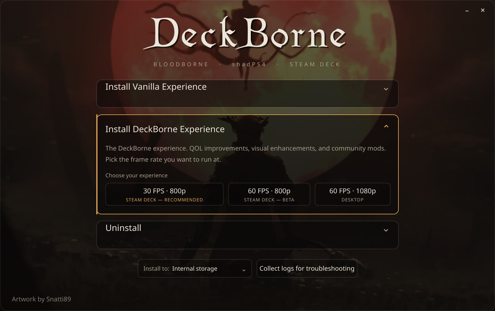
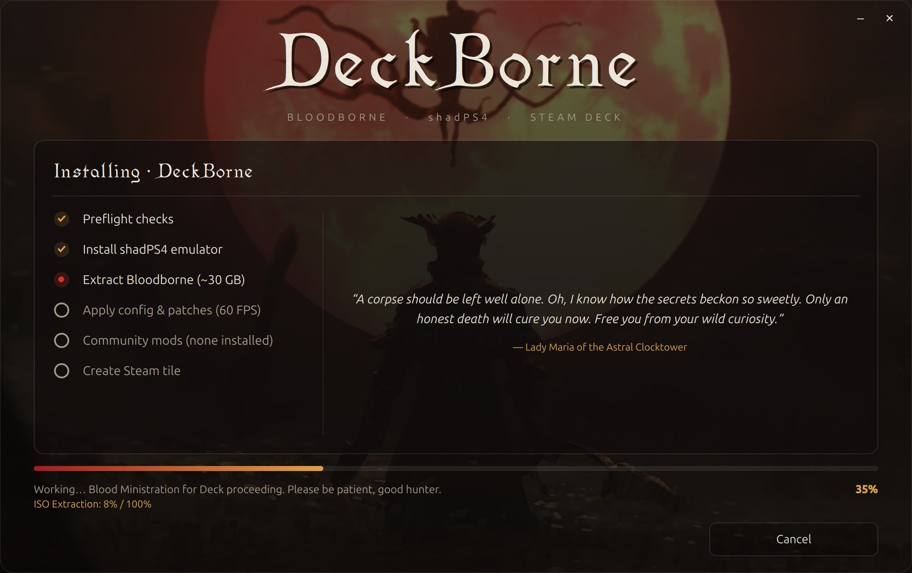

# DeckBorne

A dedicated installer tool for SteamOS that sets up **Bloodborne** on a **Steam Deck** via the **shadPS4** emulator. 

<p align="center">
  
</p>

**Whats DeckBorne?**
An all in one installer for SteamDeck and SteamOS devices. Installs the emulator, extracts your game dump, applies shadPS4 settings, compiles a list of QOL patches and applies on install directly from repos, (optional) apply your own downloaded mods from either Nexus, Game Banana, or your favorite GH creator. Lastly, the tool adds a launcher tile to Steam Big Picture and pulls art compiled out of SteamGridDB.

**DeckBorne will never provide or link BloodBorne ISO game files. You need to supply your own ISO of BloodBorne**

<p align="center">
  
</p>

**Requirements:**
- minimum of 33GB space on internal SteamDeck Storage (WiP for 00_preflight to choose storage)
- 1X 64GB USB Stick (if using USB Method)
- SteamDeck LCD/OLED (LCD Model needs more testing, i dont own one myself to validate :( )
- BloodBorne ISO and Patch v1.09 of The Old Hnters DLC.

## Installing and running DeckBorne
**USB method (From another PC to the SteamDeck):**
1. On your main computer, locate a 64GB USB stick and plug it in.
2. Download this project! (git clone or download the release) and move the ENTIRE "DeckBorne" folder/directory to the USB stick.
3. Copy your Bloodborne **`.pkg` files** into the `game-pkg` directory — the base game, plus the v1.09 update if you have it. Filenames don't matter. See [What goes in `game-pkg/`](#what-goes-in-game-pkg) below.
4. Safely Eject the USB stick from your computer.
5. Wake your SteamDeck and click the "STEAM" button on your Deck > Power > Switch to Desktop
7. Plug in the USB stick - a window will popup asking you to "Mount and Open".
8. Using the trackpad, click the USB stick with DeckBorne.
9. Find the DeckBorn folder on the USB and doubleclick into it.
10. **Double-click `DeckBorne.desktop`** — the desktop launcher. The installer window opens and
   asks you to choose an experience; pick one and it does the rest.
11. Installer will tell you "Completed" once done. When finished, close all windows and boot back into Big Picture using the icon on your SteamOS Desktop. Or Reboot, I dont judge.
    
Curl method (directly from SteamDeck Desktop mode):


### What goes in `game-pkg/`

| File | What it is | Size | Required? |
|---|---|---|---|
| **Base game** | Bloodborne itself | ~30 GB | **Yes** |
| **Update / patch** | v1.09, which includes The Old Hunters content | ~10 GB | Recommended |

**Filenames and folder structure do not matter.** DeckBorne identifies your dump by
reading the files, not by their names.  It searches `game-pkg/` **recursively**, so you can drop either a folder into "game-pkg/" containing the game file/update file, or just drop your BloodBorne.pkg and update.pkg directly into "game-pkg/"
without unpacking or renaming anything. both of these work:

```
game-pkg/                          game-pkg/
  Bloodborne.pkg                     Some.Release.Name/
  Bloodborne-update-v1.09.pkg          Some.Release.Name.pkg
                                       Some.Release.Name-update.pkg
```

**What happens if something's off:**

| Situation | Result |
|---|---|
| No `.pkg` found at all | Install **stops** with an error |
| The `.pkg` isn't Bloodborne | **Warns** and continues — other PS4 titles may work, untested |
| No matching update `.pkg` | **Warns** and continues — the base game runs un-patched |
| Two `.pkg`s with different title IDs | The larger becomes the base; the other is ignored |


| Component | Value |
|---|---|
| Emulator | shadPS4 **v0.16.0**, Linux **SDL** build (`Shadps4-sdl.AppImage`) |
| Emulator source | GitHub release asset — also **bundled** at `payloads/shadps4/` for offline installs |
| Zip SHA-256 | `7cbb19fe…dfc79b` (verified) |
| AppImage SHA-256 | `9c3656ca…8fba1a` (verified) |
| Game | Bloodborne GOTY / Complete Edition, title ID ************** (incl. The Old Hunters DLC) — the title ID is discovered from the PKG header, so other regions work too (NEEDS FURTHER TESTING) |
| Config | written to `config.json` with keys verified against the 0.16 source; see **Profiles** below |

Everything installs under `$HOME` (`~/Applications/shadps4`, `~/Games/shadps4`,
`~/.local/share/shadPS4`) so it survives SteamOS updates, which wipe the system partition.

> **shadPS4 0.16 moved its config.** It reads `$XDG_DATA_HOME/shadPS4/config.json`

## Layout

```
install.sh              # orchestrator — runs the stages in order
config/
  deckborne.env         # ← single source of truth: versions, checksums, paths, IDs, profiles
  patch_config_json.py  # section-aware config.json key setter (dependency-free, type-safe)
  patch_config.py       # DEAD — pre-0.16 config.toml setter, kept only for reference
  mods.catalog          # pointer list of known-compatible mods (URLs only, never files)
  steamgriddb.key       # SteamGridDB API key for fetch_artwork.py  [gitignored]
scripts/
  lib.sh                # shared logging / checksum / Steam lifecycle helpers
  00_preflight.sh       # env + deps + game-dump + free-space checks
  10_install_emulator.sh# download/bundle → verify → extract → verify
  20_install_game.sh    # extract base + v1.09 update .pkg into the games dir
  30_apply_config.sh    # write emulator settings to config.json (profile-dependent)
  35_apply_patches.sh   # fetch + enable shadPS4 game patches (profile-dependent)
  40_apply_mods.sh      # merge mod overlays from payloads/mods/ (reversible)
  50_steam_shortcut.sh  # register the Steam tile (+ artwork, + Recent Games warm-up)
  90_collect_logs.sh    # read-only state snapshot for troubleshooting
  99_uninstall.sh       # reverse everything, leaving no stray Steam data
steam/
  add_shortcut.py       # binary shortcuts.vdf reader/writer + localconfig.vdf cleanup
  fetch_artwork.py      # pull tile art from SteamGridDB into payloads/artwork/
ui/                     # optional QML/PySide6 desktop front-end for the installer
  main.py backend.py    #   launcher + QProcess driver over install.sh
  qml/Main.qml          #   the window
  build-appimage.sh     #   packages the UI into a self-contained AppImage
payloads/
  shadps4/              # bundled emulator zip (offline install)   [gitignored]
  mods/                 # drop extracted mods here as <name>/      [gitignored]
  artwork/              # grid/hero/logo/icon/wide images for the tile
game-pkg/               # your dump: base + update .pkg            [gitignored, ~30GB]
logs/                   # per-run logs + state snapshots           [gitignored]
```

## Profiles

DeckBorne installs one of two **experiences**. You pick in the installer window — the
difference is which shadPS4 settings and game patches get applied. Both patch sets live in
`config/deckborne.env`, and every patch is checked to make sure two of them never write to
the same memory address.

### Vanilla — as close to the original as possible

> *An experience as close to the original Bloodborne as possible. Target 30 FPS.*

Stock Bloodborne. The only patches applied are the ones needed to make it run properly on
the Deck's hardware and screen — **nothing here changes how the game plays**.

| Patch | What it does |
|---|---|
| `30 FPS++` | Tunes frame skip, vsync and tearing for better input response at 30 FPS. **It does not raise the frame rate** — the game still targets 30. |
| `Resolution Patch 1280x800 (16:10)` | Renders at the Deck's native 1280×800 instead of the PS4's 1920×1080 — roughly half the pixels — with lock-on and HP-bar positions corrected to match. |
| `1280x800 Light Grid For SteamDeck` | Lowers light-grid draw calls at that window resolution. Pure performance, no visual change. |
| `FMOD Crash Fix` | Audio-engine stability fix. Upstream notes it *"may unintentionally prevent some sound playback"*. |
| `Unlock Game Region` | Unlocks additional language options. Does **not** swap the X/O buttons. |
| `Disable HTTP Requests` | Stops the game phoning home. |

Vblank runs at 60 Hz; Bloodborne's own divide-by-2 flip rate lands that on 30 FPS.

### DeckBorne — the tuned experience

> *QOL improvements, visual enhancements, and community mods.*

⚠ **This profile is still being tuned and is currently the most conservative of the two.**
It applies only the Deck light-grid patch:

| Patch | What it does |
|---|---|
| `1280x800 Light Grid For SteamDeck` | Lowers light-grid draw calls. Pure performance. |

Higher frame-rate targets are being tested but are **not shipped yet**. Bloodborne on Deck
hardware does not comfortably hold 60, and the patches that raise the target trade one
problem for another — dropping below the target either slows the game down or introduces
physics artifacts, depending on which patch is used. Until that settles, **Vanilla is the
profile to pick.**

Community mods are supported by the installer but **not bundled** — see
[Adding mods](#adding-mods).

## Game patches (not mods)

**Patches are not mods.** shadPS4 reads XML patch files at boot and applies *memory*
patches to the running game — frame-rate, resolution, and QOL tweaks live here.
File-overlay mods are a separate thing (stage 40).

List of patches used in total for this experience:

## Adding mods

**DeckBorne never redistributes MODs** — Nexus's guidelines prohibit re-hosting another author's work, and most Bloodborne mods are repacked game assets, i.e. derivatives of copyrighted files. `config/mods.catalog` is therefore a **pointer list**: names, URLs, and install hints,
never files. You download the mods and move them under the /payloads/mods/<name>/; DeckBorne applies them on install.

Unzip a mod and drop the resulting folder into `payloads/mods/<name>/` — **as it came out
of the archive**. You do not need to fix its folder depth or match the game's layout by
hand. Stage 40 works out where the files belong by asking the installed game which depth
its files line up with, so all of these are handled:

```
payloads/mods/CoolMod/dvdroot_ps4/parts/…      # game-root relative
payloads/mods/CoolMod/parts/…                  # dvdroot-relative ("modloader friendly")
payloads/mods/CoolMod v1.2/dvdroot_ps4/menu/…  # wrapper folder from the archive
payloads/mods/CoolMod/Optional/Standard/parts/ # nested wrapper
```

Mods are merged alphabetically — prefix `00_`, `10_`, … to control precedence when two of
them touch the same file.

Stage 40 stops and asks you in exactly two cases, rather than guessing:

- **The mod ships several alternatives** (`Optional/Blue/`, `Optional/Red/`). Move the one
  you want into `payloads/mods/<name>/` yourself.
- **Its files match nothing in the game** at any depth — usually the wrong game, or an
  archive containing only a readme and screenshots.

A mod that only *adds* files (replacing none) is placed by folder name instead, and the
log says so — if such a mod has no effect in game, that is the first thing to check.

```bash
scripts/40_apply_mods.sh            # apply everything in payloads/mods/
scripts/40_apply_mods.sh --revert   # restore the pre-mods game state
```
MODs which fail to install for any reason are skipped but logged, ensuring the game builds separate from MOD dependencies.
**Two traps stage 40 warns about**, both of which produce a mod that applies perfectly
and changes nothing in game:


At the end of stage 50 you'll see **Bloodborne boot on its own for ~15 seconds and
then close**. That's deliberate — it's the only known way to get the tile onto Steam's
**Recent Games** shelf without you launching it yourself.

**Steam only writes `localconfig.vdf` when it exits.** 

## How the game gets installed (important)

shadPS4 0.16 **removed its built-in PKG installer** — the SDL build can only launch an
already-extracted game. So stage 20 extracts the `.pkg` files with the
**ShadPs4Plus standalone extractor** (built from shadPS4's own extraction code, so
output is natively compatible; **v1.1** required — it fixes corruption on PKGs >2GB).
The result of the install will extract the game to the below shadPS4 directory:

```
~/Games/shadps4/CUSA03173/eboot.bin          base game
~/Games/shadps4/CUSA03173-UPDATE/eboot.bin   v1.09 update (auto-applied by shadPS4)
```

used
rather than silently ignored. Fallback if it isn't: extract the update *over* the base.
